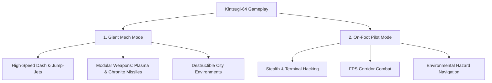

# Kickstarter Campaign Copy & Promotional Visual Assets Plan: *Kintsugi-64*

*Kintsugi-64* is a 3D first-person giant robot/mech combat game built natively for the original Nintendo 64 (N64) hardware, heavily inspired by the 1998 anime-styled classic *SHOGO: Mobile Armor Division*. Developed in C/C++ using modern toolchains and the Fast-64 Blender integration, it targets both original consoles and upcoming retro-hardware such as the ModRetro M64.

This document details the copywriting for the Kickstarter campaign page, storyboards for promotional visual assets, and a community engagement strategy.

---

## 1. Kickstarter Page Copywriting Blueprint

### Section A: The Hero (AIDA Framework)

#### **Attention (Hook)**
> **GIANT MECHS. ANIME ACTION. 64-BIT HARDWARE.**
> 
> *The fast-paced, high-mobility mech shooter the Nintendo 64 never had... until now.*
> 
> Natively compiled in C/C++ to run on actual, unmodified 1990s Nintendo 64 hardware. Experience fluid 30FPS mech combat, destructible neon-lit cities, and tense on-foot pilot missions in a cartridge-native package.

```
+------------------------------------------------------------------------------------------------+
|                                      [ BACK THE CAMPAIGN NOW ]                                 |
|               Digital ROM + Manual: $15  |  Region-Free Physical Cartridge: $60                |
+------------------------------------------------------------------------------------------------+
```

#### **Interest**
In 1998, games like *SHOGO: Mobile Armor Division* redefined mech combat with anime aesthetics, vertical mobility, and devastating firepower. But console players missed out on this golden era. While PCs enjoyed high-speed vertical dash-sliding, console gamers were stuck with slower, tank-like robot simulators.

*Kintsugi-64* brings that exact high-octane action directly to your childhood console. Built from scratch in optimized C using the modern `libultra` environment, the game features high-speed mech combat, destructible city environments, and a dual-mode gameplay loop where you control both a 15-meter Mobile Combat Armor (MCA) and the vulnerable pilot on foot.

#### **Desire**
Dust off your original controllers, plug in your EverDrive, or prepare your ModRetro M64. 

*   **Authentic 1998 Aesthetics:** Low-poly models (<500 triangles) and 16-bit RGBA textures optimized for the N64's tight 4KB TMEM cache.
*   **True Hardware Compatibility:** No emulator-only hacks. Tested and verified on original NTSC-U, NTSC-J, and PAL consoles.
*   **Dual-Gameplay Engine:** Seamless transitions between piloting a giant robotic war machine and stealthily navigating military corridors on foot.
*   **Retro Collector's Dream:** Physical region-free cartridges, complete-in-box (CIB) packages with 90s-style cardboard boxes, and full-color printed manuals.

#### **Action**
Help us bring the ultimate homebrew N64 title to life. We are fully committed to physical preservation and retro game development. Choose your tier below, download our public demo, and let's make retro history!

---

### Section B: Backstory & Lore

#### **The Neon Colony of Neo-Kobe (2098)**
One hundred years after the golden age of robotics, humanity’s survival hangs on **Crystalline Chronite**—a rare mineral found only in the subterranean depths of the Neo-Kobe colony. Chronite acts as a high-density energy source and possesses anomalous properties that allow Mobile Combat Armor (MCA) mechs to transform their alloy structures on the fly.

Corporate greed has fractured the colony. The Neo-Kobe Police Force (NKPF) clashes daily with rogue mercenary syndicates funded by rival mega-corporations.

```
       +-----------------------------------------------------------------+
       |                        THE FACTIONS OF NEO-KOBE                 |
       +-----------------------------------------------------------------+
       |  1. NKPF (Neo-Kobe Police Force)  |  2. Chronite Syndicate      |
       |  - Order and control              |  - Rogue mercenary corps    |
       |  - Outnumbered, defending Neo-Kobe|  - Upgraded Chronite Mechs  |
       |  - Standard issue MCAs            |  - Experimental weapons     |
       +-----------------------------------------------------------------+
```

#### **Your Mission**
You are **Kenji Vance**, a disgraced former pilot of the elite *Kintsugi Squadron*. After a failed operation left your squad decimated, you were discharged and left to rot in the lower districts. 

When the Chronite Syndicate launches a coordinated assault on the colony's central reactor, the NKPF is forced to reinstate you. Armed with the *Kintsugi-01*—a patched-together, custom MCA prototype repaired using gold-alloy joints (a nod to the ancient art of Kintsugi)—you must descend into the neon trenches of Neo-Kobe, uncover the corporate conspiracy, and prevent the reactor's meltdown.

---

### Section C: SHOGO-Inspired Gameplay Features (PAS Framework)

#### **Problem**
> "Developing for the Nintendo 64 in the 21st century is notoriously difficult. The system's memory constraints (4MB/8MB RDRAM) and tight microcode requirements mean modern game engines cannot run, leaving retro hardware enthusiasts with few new titles to play."

#### **Agitate**
Most modern 'retro' games are just PC games styled with filters. They don't actually run on retro hardware, and they lack the authentic micro-optimizations, rendering quirks, and physical feel of a cartridge sliding into a console slot. For true retro collectors, emulations and PC demakes simply don't satisfy. 

#### **Solve**
*Kintsugi-64* is built natively for the N64 architecture. By integrating Blender's `Fast-64` plugin, we optimize 3D geometry down to under 500 triangles per model and textures to fit the tight 4KB TMEM cache. Using a custom C++ engine compiled via MIPS GCC, we bypass modern bloat to achieve stable performance on actual N64 consoles, creating a true, cartridge-native game that honors the limits and strengths of 1998 hardware.

#### **Core Gameplay Pillars**



##### **1. Giant Mech Mode (MCA)**
Step into the cockpit of the *Kintsugi-01* and experience intense, high-agility mech combat:
*   **High Mobility:** Use vertical jump-jets to leap onto skyscrapers, and execute directional slide-dashes to dodge incoming missile barrages.
*   **Modular Weapons System:** Equip up to three weapons at once. Fire lock-on Chronite Micro-Missiles, incinerate squads with the Plasma Auto-Cannon, or engage in close-quarters combat using the Energy Naginata.
*   **Destructible Environments:** Blast through billboards, traffic structures, and minor security towers to create new tactical paths or uncover hidden items.

##### **2. On-Foot Pilot Mode**
When security gates block your MCA, or a facility’s corridors are too narrow for a 15-meter robot, you must eject:
*   **Tense FPS Gameplay:** Navigate tight, dark corridors as Kenji Vance. You are fast and agile but extremely vulnerable—a single turret blast or infantry grenade can end your run.
*   **Security Hacking:** Locate keycards, bypass security terminals, and disable chronite barriers to clear a path for your mech.
*   **Vulnerability Contrast:** Experience the massive shift in scale and tension when you step out of a towering war machine and into a hostile, claustrophobic military bunker.

---

### Section D: Technical Specs & Engine Optimizations
For the homebrew developers and hardware enthusiasts, *Kintsugi-64* is a technical achievement on the N64:

*   **RSP display list optimization:** Fully custom display lists utilizing `F3DEX2` microcode, maximizing vertex processing speeds.
*   **Strict TMEM Management:** Textures are limited to 4 KB. We utilize `CI8` and `CI4` (Color Index) formats with 256-color and 16-color palettes to achieve detailed textures at double the resolution of standard `RGBA16`.
*   **Optimized Collision Detection:** A custom, lightweight axis-aligned bounding box (AABB) system designed for the N64's MIPS processor, preventing framerate dips during hectic combat.
*   **Expansion Pak Support:** The game runs on standard 4MB systems at 240p, but detects and utilizes the 8MB Expansion Pak to enable enhanced particle effects, high-fidelity audio, and a smoother framerate.

---

## 2. Promotional Visual Assets & Storyboards

### A. Pitch Video Storyboard (2 Minutes)
**Target Tone:** 90s anime style mixed with high-energy retro game marketing. Intense electronic/industrial synth soundtrack (reminiscent of SHOGO's OST).

| Time | Visual Scene | Audio & Sound Effects (SFX) | Voiceover (VO) |
| :--- | :--- | :--- | :--- |
| **0:00–0:15** | Neon-lit city skyline of Neo-Kobe. Suddenly, a red alarm flashes. A giant mech (*Kintsugi-01*) boots up, its mono-eye glowing gold. It dashes forward, kicking up dust. | Low industrial hum building into a sharp power-up whine. Heavy mechanical clanks. | *"The year is 2098. Neo-Kobe is burning. And you are the last line of defense."* |
| **0:15–0:40** | **Gameplay (MCA Mode):** Fast-paced action. Mech slide-dashing between neon buildings, locking onto three enemy mechs, and releasing a barrage of micro-missiles. Debris falls. | High-tempo 90s industrial synth rock kicks in. Sound of rocket thrusters, explosions, and metallic impacts. | *(No VO - Gameplay speaks for itself. On-screen text: "HIGH-AGILITY MECH COMBAT")* |
| **0:40–0:55** | **Gameplay (Pilot Mode):** Cut to pilot's perspective inside a dark facility. Firing an energy pistol at guard drones, running through a closing blast door, and hacking a terminal. | Synth music drops in volume, replaced by echoing footsteps, distant alarms, and rapid laser fire. | *"Eject. Navigate. Survive. Experience the scale of war from the ground up."* |
| **0:55–1:20** | **Technical Validation:** Camera zooms out from a real CRT television showing the game running. Hand holding a grey N64 controller. Quick cuts of Blender Fast-64 exporter and MIPS compiler logs. | Music swells. SFX of plastic cartridge being clicked into an N64 console. | *"Built from the ground up in C++ for the original N64 hardware. Zero emulator hacks. Pure 64-bit power."* |
| **1:20–1:45** | **Reward Showcases:** 3D spins of the physical grey cartridge, the retro cardboard box (CIB), and the vintage-style printed instruction manual. | Music continues high-energy. | *"Get the physical cartridge, the classic CIB edition, or exclusive in-game backer skins."* |
| **1:45–2:00** | Logo splash: *KINTSUGI-64*. Backer URL and social handles. | Final musical crescendo, ending with a deep mechanical powering-down sound. | *"Back Kintsugi-64 on Kickstarter today. Let's bring retro mech action back to the cartridge."* |

---

### B. Screenshot Mockups & Captions
To showcase the game’s depth, we will present 5 key screenshots on the Kickstarter page, framed with a retro N64-style UI border.

1.  **Screenshot 1: The Neon Trenches (MCA Mode)**
    *   *Visuals:* The *Kintsugi-01* mech stands on a skyscraper roof overlooking a street filled with neon billboards. An enemy mech in the distance is locked-on in a red targeting reticle.
    *   *Caption:* *"Engage targets in vertical, neon-drenched urban arenas."*
2.  **Screenshot 2: Tactical Evacuation (Pilot Mode)**
    *   *Visuals:* Kenji Vance holding a laser rifle, looking down a metallic, steam-filled corridor. An security terminal glows green in the distance.
    *   *Caption:* *"Eject from your MCA to infiltrate secure military installations on foot."*
3.  **Screenshot 3: Heavy Artillery (MCA Mode)**
    *   *Visuals:* A close-up of a weapon swap, firing the Plasma Auto-Cannon at a mercenary spider-tank. Pixelated energy projectiles light up the dark environment.
    *   *Caption:* *"Equip a devastating arsenal of modular projectile and melee weapons."*
4.  **Screenshot 4: The Developer's Viewport (Technical)**
    *   *Visuals:* Side-by-side view: the low-poly wireframe of the mech prototype in Blender (<450 triangles) next to its final rendered form on the N64 emulator.
    *   *Caption:* *"Rigorous polygon optimization ensuring stable framerates on original hardware."*
5.  **Screenshot 5: Hardware Proof (N64 Console)**
    *   *Visuals:* A photograph of an original Nintendo 64 console on a desk, hooked up to a Sony Trinitron CRT monitor showing *Kintsugi-64*'s main title screen.
    *   *Caption:* *"Tested, verified, and running natively on authentic 64-bit hardware."*

---

### C. Concept Art Board Layouts
We will display development concept art sketches to emphasize the creative process and authenticity:
*   **The Mech Schematics:** Blueprints showing the joint mechanics of the *Kintsugi-01*, highlighting where gold-alloy repairs were made to the low-poly framework.
*   **Pilot Gear Sketches:** 90s anime-style character designs of Kenji Vance in his pilot suit, with notes on facial expressions and helmet designs.
*   **Colony Architecture Concept:** Digital paintings of Neo-Kobe's vertical layout, demonstrating the contrast between the wealthy corporate skyscrapers above and the messy, neon-lit slums below.

---

## 3. Community Engagement & Pre-Launch Outline

To secure Day 1 funding, we must engage retro-gaming communities with valuable, high-signal content rather than generic spam.

### A. Targeted Communities & Value-Add Content

#### **1. ModRetro Community (M64 Console Hub)**
*   **Angle:** Direct compatibility with their upcoming hardware.
*   **Content:** Post updates demonstrating how *Kintsugi-64* runs on the ModRetro hardware, focusing on controllers and display output.
*   **Thread Pitch:** *"Designing a cartridge-native game for the next generation of N64 hardware."*

#### **2. RetroRGB & NESdev Forums**
*   **Angle:** Technical breakdown and deep-dive engineering.
*   **Content:** Write highly technical devlogs explaining how we squeezed 16-bit texture details out of 4KB TMEM using CI8 color indexing and customized F3DEX2 display lists.
*   **Thread Pitch:** *"Overcoming N64 hardware limits: How we built a custom C/C++ engine for Kintsugi-64."*

#### **3. Reddit (`r/n64`, `r/retrodev`, `r/homebrew`)**
*   **Angle:** Nostalgia, visual proof, and developer-to-player engagement.
*   **Content:** High-frequency weekly GIFs showing gameplay mechanics (dashing, transforming, explosions) alongside code snippets.
*   **Thread Pitch:** *"I'm building a SHOGO-inspired mech shooter for the original N64. Here is gameplay running on real hardware!"*

---

### B. 8-Week Engagement Schedule

```
+------------------------------------------------------------------------------------------------+
|                                    8-WEEK ENGAGEMENT SCHEDULE                                  |
+------------------------------------------------------------------------------------------------+
| W1-2: Landing Page Reveal & Engine Devlog #1 (Engine Setup)                                    |
| W3-4: Blender-to-N64 Exporter Devlog #2 (Fast-64 Pipeline) & Twitter GIF Campaign              |
| W5-6: Playable ROM Demo Release & Speedrun Competition                                         |
| W7-8: Live Hardware Q&A Stream & Kickstarter Launch (Tuesday, 10 AM)                            |
+------------------------------------------------------------------------------------------------+
```

*   **Weeks 1–2: Foundation**
    *   *Reddit & Forums:* Post Devlog #1: *"Building a Mech Engine for the N64 from Scratch in C."* Discuss setting up the compiler and memory map.
    *   *Twitter/X:* Release a 10-second clip of the mech's walking animation. Use hashtags: `#N64 #RetroDev #IndieDev`.
*   **Weeks 3–4: Asset Pipeline Pipeline**
    *   *Forums:* Post Devlog #2: *"Designing low-poly mechs with Blender and Fast-64."* Share polygon count details and texture compression techniques.
    *   *Twitter/X & TikTok:* Post a looping GIF of the slide-dash mechanic, showing the contrast between the Blender viewport and the game running on a CRT screen.
*   **Weeks 5–6: Playable Demo Drop**
    *   *All Platforms:* Release the free, 1-level playable `.z64` ROM. Host it on itch.io.
    *   *Community Contest:* Announce a $100 physical cart prize for the fastest speedrun of the demo posted to Twitter/X or Reddit.
*   **Weeks 7–8: Pre-Launch Warmup**
    *   *YouTube & Twitch:* Host a live Q&A showing the game running on a real N64 console. Address compatibility questions (PAL, EverDrive, ModRetro).
    *   *Email Waitlist:* Send "48 Hours to Go" email detailing the limited "Ace Customizer" early-bird tier.
*   **Launch Week (Week 9)**
    *   *Day 1 (Tuesday, 10 AM):* Launch Kickstarter. Email the waitlist. Post the Pitch Video to Reddit and forums.
    *   *Day 3:* Post FAQ addressing shipping costs and cartridge region selections.
    *   *Day 5:* Share the first stretch goal (e.g., custom music tracks by a guest artist).

---

### C. Sample Social Media Copy & Hooks

#### **Twitter/X Hook (GIF showing MCA dashing and shooting)**
> 🤖 Giant mechs.
> 💥 Destructible neon cities.
> 🕹️ Running natively on your childhood N64.
> 
> We're building the high-mobility anime mech shooter the N64 missed out on in 1998. Playable demo drops in 2 weeks!
> 
> \#RetroDev \#N64 \#HomebrewGame \#IndieDev

#### **Reddit Post Hook (`r/n64`)**
> **[Project Showcase] Building a SHOGO-inspired N64 Mech game in C/C++ (runs on real hardware!)**
> 
> Hey r/n64! For the past few months, our team has been working on *Kintsugi-64*, a native 64-bit giant robot game designed to run on authentic, unmodified consoles. We were heavily inspired by PC classics like *SHOGO* and wanted to bring that fast-paced, vertical action to cartridges.
> 
> We've optimized the geometry down to <500 polys per mech and are squeezing our textures into the 4KB TMEM cache. Check out the gameplay GIF below showing the Kintsugi-01 dashing through our first city district.
> 
> Would love to get your thoughts on the mechanical design and region configurations! We have a playable ROM coming out soon.

#### **TikTok Hook (First 3 Seconds Video Script)**
*   *(Visual: Hand sliding a custom grey cartridge into a Nintendo 64. Console turns on, displaying a giant robot on a CRT TV.)*
*   **Audio (VO):** *"Wait, you're telling me this isn't an old game you missed? We actually built this in C++ this year to run on real N64 hardware."*
*   *(Visual: Rapid cuts of gameplay, mech dashing, and pilot running down corridors.)*
*   **Caption:** *Kintsugi-64 is coming to cartridges. Playable demo link in bio! #retro #n64 #gaming #retrogaming #gametok*
