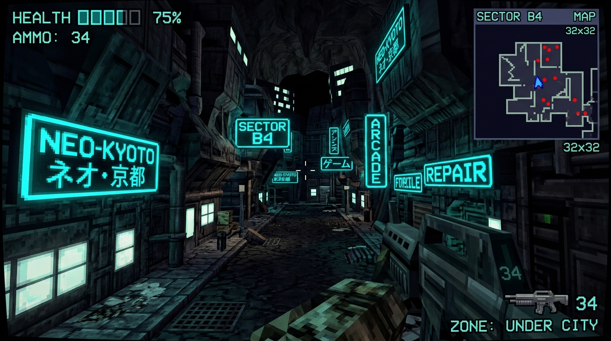
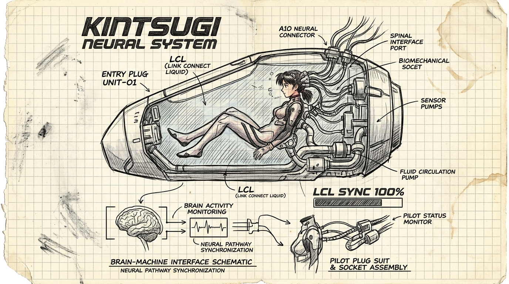
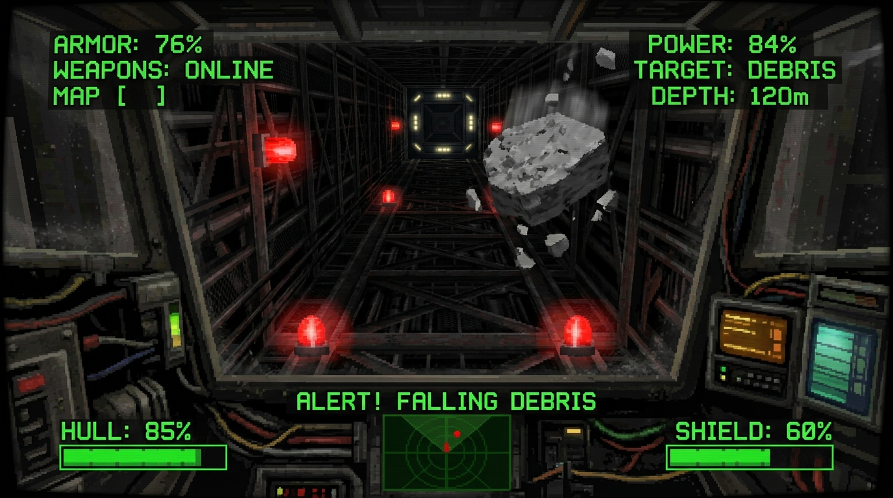

# Kintsugi-64: Tokyo-3 Main Loop Showcase Copy & Reward Strategy

*Kintsugi-64* is a 3D first-person giant robot/mech combat game built natively for original Nintendo 64 hardware, inspired by the 1998 anime-styled classic *SHOGO: Mobile Armor Division*. This document outlines the marketing concept and promotional copy designed for the Kickstarter campaign, focused on the **Tokyo-3 Subterranean Exploration and Mecha Transition Loop**.

---

## 1. Kickstarter Update Copy: "Red Alert in Neo-Kobe!"

**Subject:** Kickstarter Update #X: Red Alert in Neo-Kobe! Experience the Tokyo-3 Underground Exploration & Mecha Transition Loop

### The Contrast of Scale: From Vulnerable Pilot to Towering Mech

Imagine walking through the neon-drenched, cyan-lit subterranean streets of Tokyo-3. You are **Kenji Vance**, a disgraced former pilot on foot. Above you, a massive sliding ceiling gate seals the colony from the surface. Around you, citizens whisper in fear of the impending corporate syndicate invasion. Some panic; others, like the enigmatic Rei, stay quiet, trusting the machines.

This is where *Kintsugi-64* begins. But the peace doesn't last.

Suddenly, sirens wail. The screen flashes red. An explosion shakes your viewport. **WARNING: INVASION IN PROGRESS.** You must navigate through the streets, find your way to the elevator bay, and initiate neural synchronization.

Inside the cockpit, the interface boots:
- *LCL Chamber Flooding...*
- *Neural Link Calibrating...*
- *Weapons Systems Synchronizing...*

Then, **catapult launch.** You are propelled up the high-speed elevator shaft. In a tense dodge game, you must slide left and right within the tight elevator chamber boundaries to evade falling concrete blocks and corporate syndicate debris. Reaching the surface, you exit the shaft—no longer a vulnerable human, but the pilot of the towering **Kintsugi-01** mecha, ready to reclaim the surface.

Below, check out our newly completed implementation of this transition loop running natively on N64 hardware:

*Figure 1: On-foot exploration mode. Walk the subterranean streets of Tokyo-3, converse with citizens, and prepare for the red alert.*

*Figure 2: The neural synchronization blueprint. Experience the high-fidelity 90s anime transition from pilot to machine.*

*Figure 3: High-speed elevator shaft ascension. Dodge falling debris and monitor your cockpit HUD while climbing to the surface.*

---

## 2. Specific Reward Tiers & Highlights

We have structured the reward tiers to highlight this unique gameplay loop and appeal to retro-hardware enthusiasts, collectors, and fans of 90s giant robot anime.

### TIER 1: "Digital Pilot" (Pledge $15)
- **Digital ROM (.z64)**: Optimized to run on modern emulators (Project64, Pyrite64) and flashcards (EverDrive-64).
- **Digital Instruction Manual**: A high-resolution, full-color PDF manual styled after 90s cartridge game pamphlets.
- **Backer Updates**: Exclusive access to devlogs detailing the C/C++ engine, Fast-64 asset pipelines, and hardware profiling.

### TIER 2: "Underground Infiltrator" (Pledge $35)
- **Everything in Digital Pilot** plus:
- **Digital Concept Art Book**: High-resolution concept art of the Tokyo-3 underground layout, mechanical blueprint schematics of the *Kintsugi-01*, and pilot suit designs.
- **Original Soundtrack (OST)**: High-quality MP3/FLAC download of the fast-paced 90s industrial synth soundtrack.
- **Neo-Kobe Citizens Directory**: Your name listed in the game's credits under the subterranean residents list.

### TIER 3: "Catapult Launch Edition" (Pledge $60)
*For the physical retro collectors.*
- **Physical Region-Free Cartridge**: A high-quality, gray N64 cartridge shell containing the custom PCB, fully tested and verified to run on NTSC-U, NTSC-J, and PAL consoles.
- **Full-Color Printed Manual**: Physical instruction manual detailing pilot controls, HUD readouts, weapons systems, and colony lore.
- **Digital ROM & PDF Manual included**.

### TIER 4: "Kintsugi Mecha Commander (CIB)" (Pledge $100)
*The ultimate collector's package.*
- **Everything in Catapult Launch Edition** plus:
- **Vintage Box Packaging**: Complete-in-Box (CIB) package with 90s-style glossy cardboard box packaging.
- **Custom Gold-Accent Cartridge**: A special cartridge shell featuring gold-alloy seams mimicking the Japanese art of Kintsugi.
- **Physical Blueprint Poster**: An A3-sized blueprint poster of the *Kintsugi-01* mecha's hydraulic and neural systems.

### TIER 5: "Ace Pilot Preserver" (Pledge $250 - Limited to 30 Backers)
*Interact directly with the Tokyo-3 game loop.*
- **Everything in Kintsugi Mecha Commander** plus:
- **Limited-Edition Gold Cartridge Shell**: A unique gold-plated cartridge housing.
- **Custom Citizen Dialogue**: Work with our narrative developer to customize a citizen dialogue option in the underground Tokyo-3 sequence! Backers can define a citizen's name and their response (fearful or ignoring the threat) during the pre-alarm exploration phase in the final ROM.
- **3D Printed Kintsugi-01 Model**: A low-poly, physical 3D-printed model of the player's mech, hand-painted with gold-alloy accents.

---

## 3. Community Outreach & Marketing Strategy

To market this specific Tokyo-3 transition loop, we will target niche retro-gaming and anime-enthusiast communities:

1. **Reddit (`r/n64`, `r/retrodev`, `r/homebrew`)**:
   - *Hook*: "We built a playable 90s anime transition loop in C for original N64 hardware. Here's a preview of the cockpit sync & high-speed elevator ascension!"
   - *Visual*: A looping GIF showcasing the transition from on-foot dialogue to red-alert flashing, the neural sync screen, and the fast scrolling elevator shaft.
2. **ModRetro Forum (M64 Console community)**:
   - Highlight the direct hardware compatibility of the first-person dialogue system and cockpit HUD rendering.
3. **Twitter/X (using `#N64`, `#RetroDev`, `#IndieGame`)**:
   - Run short, high-energy clips of the elevator dodging game with retro sound effects.
